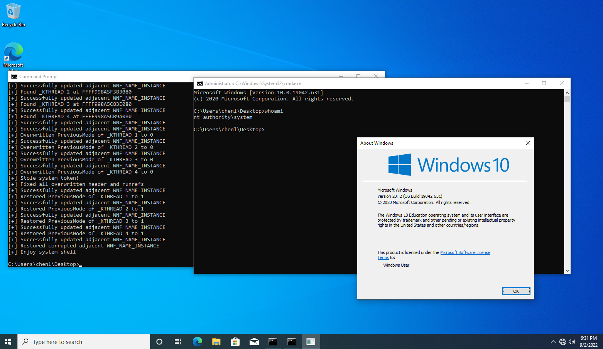

# PoC for CVE-2021-31956: Windows Kernel Privilege Escalation Vulnerability

## Overview
CVE-2021-31956 is a privilege escalation vulnerability in Windows systems caused by improper handling of objects in memory by the Windows kernel. This vulnerability can be exploited by local attackers to elevate privileges on affected systems.

- **CVE ID**: CVE-2021-31956
- **Severity**: High
- **Attack Vector**: Local
- **Exploit Type**: Privilege Escalation
- **Affected Systems**: Various Windows versions, including Windows 10 (specific versions may vary; verify per Microsoft’s official security advisory).

## Requirements
To exploit this vulnerability, an attacker must have local access to the target system. The exploit typically requires:
- Knowledge of kernel structures and memory manipulation.
- Administrative or SYSTEM-level shell access for privilege escalation.

**Example Screenshot of Vulnerable Environment Setup:**




## Exploit Steps
### Step 1: Set up the Vulnerable Environment
Ensure the test environment runs a vulnerable version of Windows. The specific configurations for the vulnerable Windows version are:
- **OS Version**: Windows 10 **21H1 19043.928**
- **Patch Level**: Ensure the system does not have security updates installed post-June 2021 (KB5003637 mitigates this vulnerability).

### Step 2: Exploitation Steps
1. **Trigger the Vulnerability**: Manipulate the vulnerable system call or memory handling mechanism.
    - This generally requires the use of a malicious driver or custom script to exploit the memory handling flaw.
2. **Corrupt Kernel Memory**: Use the exploit to gain control of a privileged kernel object.
3. **Escalate Privileges**: Escalate the process privileges to SYSTEM by manipulating memory structures.

## Testing and Validation
1. **Compile and Run the Exploit**:
   ```bash
   gcc CVE-2021-31956.c -o CVE-2021-31956.exe
   CVE-2021-31956.exe
